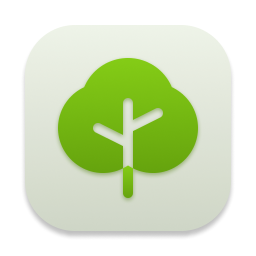

<!-- markdownlint-disable-next-line first-line-h1 -->

  [![Contributors][contributors-shield]][contributors-url]
  [![Forks][forks-shield]][forks-url]
  [![Stargazers][stars-shield]][stars-url]
  [![Issues][issues-shield]][issues-url]
  [![MIT License][license-shield]][license-url]
  [![LinkedIn][linkedin-shield]][linkedin-url]

  

  <h1>Treevia</h1>

  

    <strong>The trivia game with more than <em>tree</em> thousand verified questions</strong> 
    <a href="https://treevia.vercel.app">treevia.vercel.app</a>
  

   
   

Choose questions from many categories and prove you are the smartest by getting extra points answering early. Can you beat your high score?

Keep in mind that you need to have a [gravatar](https://gravatar.com) profile pic associated with the input email for it to show up in the header

 
 

  <kbd>
    
  </kbd>
  <kbd>
    
  </kbd>
   
   

  
Table of Contents

  <ol>
    <li><a href="#screenshots">Screenshots</a></li>
    <li><a href="#built-with">Built with</a></li>
    <li><a href="#installation">Installation</a></li>
    <li><a href="#roadmap">Roadmap</a></li>
    <li><a href="#known-issues">Known issues</a></li>
    <li><a href="#license">License</a></li>
    <li><a href="#contact">Contact</a></li>
  </ol>

## Screenshots

  
  
  
  

## Installation

- [Chrome](https://support.google.com/chrome/answer/9658361?hl=en&co=GENIE.Platform%3DDesktop)
- [Safari](https://mobilesyrup.com/2020/05/24/how-install-progressive-web-app-pwa-android-ios-pc-mac/#:~:text=Navigate%20to%20the%20website%20you,like%20a%20native%20iOS%20app)

## Built with

- [React.js](https://reactjs.org/)
- [React Router](https://reactrouter.com/)
- [Redux](https://redux.js.org/)
- [Tailwind](https://tailwindcss.com/)

## Roadmap

- [x] Login page
- [x] Gravatar profile pic
- [x] Fetch questions from [opentdb](https://opentdb.com)
- [x] Finish trivia flow
- [x] Trivia result feedback page
- [x] Custom trivia category selection
- [x] Dark mode
- [ ] Backend leaderboards

## Known issues

These no known issues at the moment. If you find one, please [open an issue](https://github.com/pedrossdemelo/treevia/issues), it would be greatly appreciated!

## License

Distributed under the GPL 3.0 License. See `LICENSE` for more information.

## Contact

- [pedrosousa.dev](https://pedrosousa.dev)

<a href="#top">Back to top</a>

[contributors-shield]: https://img.shields.io/github/contributors/pedrossdemelo/treevia?style=for-the-badge
[contributors-url]: https://github.com/pedrossdemelo/treevia/graphs/contributors
[forks-shield]: https://img.shields.io/github/forks/pedrossdemelo/treevia?style=for-the-badge
[forks-url]: https://github.com/pedrossdemelo/treevia/network/members
[stars-shield]: https://img.shields.io/github/stars/pedrossdemelo/treevia?style=for-the-badge
[stars-url]: https://github.com/pedrossdemelo/treevia/stargazers
[issues-shield]: https://img.shields.io/github/issues/pedrossdemelo/treevia?style=for-the-badge
[issues-url]: https://github.com/pedrossdemelo/treevia/issues
[license-shield]: https://img.shields.io/github/license/pedrossdemelo/treevia?style=for-the-badge
[license-url]: https://github.com/pedrossdemelo/treevia/blob/main/LICENSE
[linkedin-shield]: https://img.shields.io/badge/-LinkedIn-black?style=for-the-badge&logo=linkedin&colorB=555
[linkedin-url]: https://linkedin.com/in/pedrossdemelo/
